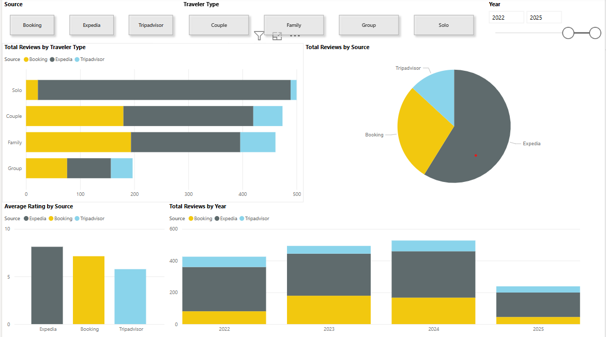

# Hotel Review Scraper and Analyzer 🏨📊

This project scrapes hotel review data from **Booking.com**, **Expedia**, and **TripAdvisor**, cleans and merges the data, and analyzes it using Python libraries like pandas, matplotlib, seaborn, and more. It aims to explore patterns in guest sentiment and ratings, including running sentiment analysis on review texts, and provides a foundation for advanced forecasting and dashboarding.

---

## 🚀 Project Structure

### 1. **Data Collection (Selenium + BeautifulSoup)**
- Scrapes reviews from three platforms:
  - Booking.com
  - Expedia
  - TripAdvisor
- Extracts fields like:
  - Review text (positive + negative)
  - Rating
  - Traveler name
  - Date of review
  - Length of stay
  - Traveler type 
- Handles pagination and review modals.
- Saves results as `.csv` files per platform.

### 2. **Data Cleaning**
- Merges Booking, Expedia, and TripAdvisor datasets.
- Normalizes column names and data types:
  - Converts dates to `datetime`
  - Converts ratings to numeric types
  - Removes duplicates (based on text + name + date)
  - Filters out very old or empty reviews
- Standardizes traveler types (e.g., “solo traveler” → “solo”).
- Saves a unified, clean dataset for analysis.

### 3. **Data Analysis & Visualization**
- Exploratory Data Analysis (EDA) including:
  - Rating distribution histograms
  - Review counts per platform and traveler type
  - Average ratings over time (yearly/monthly trends)
  - Boxplots and bar charts
- Sentiment analysis applied to review texts to gauge guest feelings.

### 4. **Future Plans**
- Develop interactive dashboards (e.g., Power BI, Streamlit) for hotel operators.
- Apply AI and machine learning models for:
  - Rating forecasting and trends prediction
  - Sentiment-driven insights and alerting
  - Deeper customer segmentation
- Explore natural language processing (NLP) for detailed sentiment and topic modeling.

---

## 📊 Sample Visualizations



---

## 📌 Notes

- Traveler Type is available from Booking.com and partially from other platforms, standardized during cleaning.
- Duplicate reviews across platforms are identified and removed.
- All review dates are normalized and filtered for recent years (2014+ or 2020+ as needed).
- Sentiment analysis uses basic NLP techniques to classify review tone (positive, negative, neutral).

---

## 📁 Files

- `bookingScraper.py` – Booking.com scraper  
- `expediaScraper.py` – Expedia scraper  
- `tripAdvisorScraper.py` – TripAdvisor scraper  
- `dataCleaner.py` – Data merging and cleaning  
- `dataAnalyzer.py` – Visual and statistical analysis
- `customerInsights.py` - Sentiment analysis
- `Reviews_Report.pbix` - PowerBI report (in progress)
---

## 🛠️ Requirements

```bash
pip install pandas matplotlib seaborn beautifulsoup4 selenium undetected-chromedriver plotly textblob
```

### ⚠️ Disclaimer

This project is for educational and personal research only. Data from Booking.com, Expedia, and TripAdvisor is collected via automated scraping tools and is not for commercial use. Respect all platform terms of service and data privacy rules.
